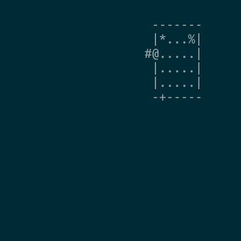

# rogue-gym-agents-cog19
This repository contains codes for exprimens in
[COG2019 Rogue-Gym: A New Challenge for Generalization in Reinforcement Learning](https://arxiv.org/abs/1904.08129).

## Watch agents
Here I show gifs of agents appeared in Section 6.4 in the paper.

### Overfitted Agent
CNN + 10 training seeds



### Generalized Agent
ResNet + L2 regularization + 40 training seeds


## Setup
1. Install pipenv
```
pip3 install pipenv -U --user
```

2. (Optional) Modify Pipfile
For example, if you want to use PyTorch 1.0.0, specify `torch = '==1.0'` in Pipfile.

3. Create the virtual env
```
pipenv --site-package --three
pipenv install
```

## Usage
All hyper paremters are at [env.py](agents/env.py) and you need to
edit the file to change the experiment setting.

### Train agents
- PPO with nature CNN
```
pipenv run python agents/ppo_naturecnn.py train
```
- PPO with impala CNN
```
pipenv run python agents/ppo_impalacnn.py train
```
- PPO with β-VAE feature extractor(β is hard coded in the file)
```
pipenv run python agents/vae_ppo.py train
```

### Evaluate agents
```
pipenv run python agents/eval_seeds.py --logdir=$YOUR_LOD_DIR
```

